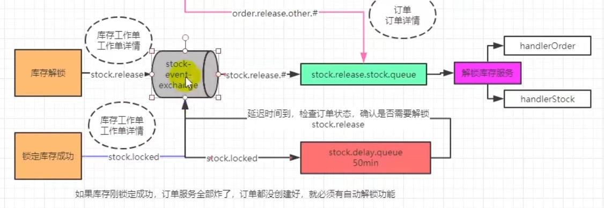

### 库存自动解锁的流程
首先当库存锁定成功之后，会创建stock.locked这个路由键，当库存锁定的详细信息发送到stock-event-exchange这个交换机里面之后，通过stock.locked把消息发送到延迟队列中，延迟队列设定好过期时间，经过一段时间之后队列中的所有内容会重新转发给这个交换机然后交换机通过stock.release这个路由键将消息发送给stock.release.stock.queue这个队列，这个队列会被监听，消息发送到队列之后再检查订单是否提交、支付等信息，如果没有提交或支付就再将之前锁定的库存进行解锁，在这个过程中通过使用消息队列的方式完成柔性事务最终完成分布式事务的最终一致性。